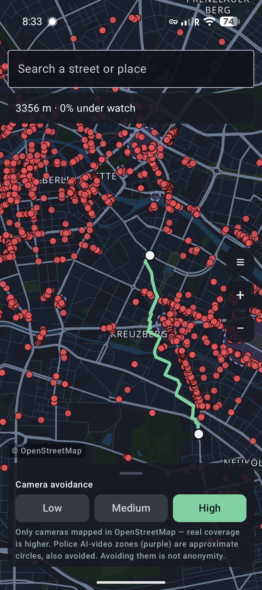
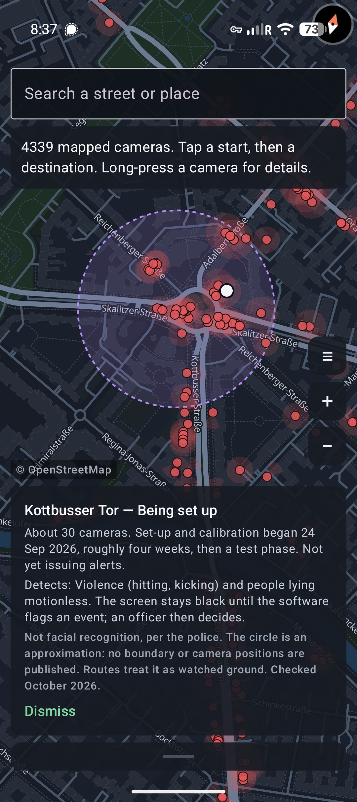
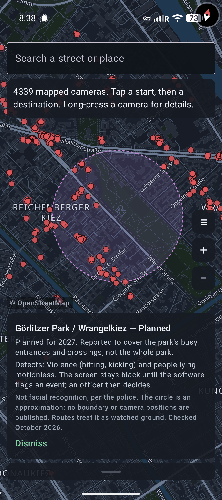

# Schattenweg

A privacy-first Android app that maps Berlin's CCTV cameras and plans walking
routes that **avoid** them — trading a little extra walking for less time in
view of a lens.

> *Schattenweg* — the shadow path.

It works **completely offline**. The map, the camera data, the search box and
the routing all live on your phone. Nothing you do — where you are, where you're
going, the route you take — ever leaves the device. The app doesn't even hold
the permission to reach the internet.

<p align="center">
  <a href="https://github.com/phrag/SchattenWeg/releases/download/latest/schattenweg-latest-debug.apk"><b>⬇&nbsp;Download the latest APK</b></a>
  &nbsp;·&nbsp;
  <a href="https://github.com/phrag/SchattenWeg/releases/tag/latest">release notes</a>
  &nbsp;·&nbsp;
  <a href="https://github.com/phrag/SchattenWeg/releases">all versions</a>
</p>

<p align="center">
  
  
  
</p>
<p align="center"><sub>A camera-free route at <b>High</b> avoidance &middot; police AI-video zones (violet circles), long-press for details</sub></p>

---

## Contents

- [Download &amp; install](#download--install) — get it on your phone
- [What it does](#what-it-does)
- [How to use it](#how-to-use-it) — a quick walkthrough
- [Your privacy](#your-privacy)
- [Honesty about the limits](#honesty-about-the-limits)
- [Build from source](#build-from-source) — for developers
- [Contributing](#contributing)
- [Report a problem](#report-a-problem)
- [Credits](#credits) &middot; [Licence](#licence)

---

## Download & install

1. **[Download the latest APK](https://github.com/phrag/SchattenWeg/releases/download/latest/schattenweg-latest-debug.apk)**
   — a direct link, rebuilt on every push to `main`, so it is always the newest
   build. (Its [release page](https://github.com/phrag/SchattenWeg/releases/tag/latest)
   says which commit and OSM snapshot it carries.)
   - Want a fixed version instead? Tagged builds like `v0.1.0` are on the
     **[Releases page](https://github.com/phrag/SchattenWeg/releases)**.
2. Copy it to your phone and tap it. Android will ask you to allow installing
   from this source — that's the normal sideloading prompt for an app that
   isn't from a store.
3. Open **Schattenweg**. No sign-in, no setup, no network — it's ready.

**Requirements:** Android 10 (API 29) or newer. Works on de-Googled devices such
as **GrapheneOS** — there are no Google Play Services to miss.

> The APKs in Releases are **debug-signed**: they install and run, and they're
> the easiest way to try the app. They aren't a store-grade signed build. If you
> prefer, you can [build from source](#build-from-source) instead.

Right now the data covers **Berlin only**.

---

## What it does

- **Shows the cameras.** Every `man_made=surveillance` camera OpenStreetMap
  knows about in Berlin, drawn on an offline map with its modelled field of
  view. Long-press one to see its details.
- **Routes around them.** Pick a start and a destination and Schattenweg finds a
  walking route that stays out of camera view where it reasonably can. A simple
  **Low / Medium / High** control sets how much extra walking you'll accept to
  dodge a lens — and when a camera-free route exists, a freshly dropped A→B pair
  takes it by default.
- **Marks Berlin police AI-video zones.** Sites where the police run or have
  announced AI behaviour detection on CCTV (Kottbusser Tor, Warschauer Brücke,
  Alexanderplatz, Görlitzer Park and more) are drawn as violet dashed circles
  and treated as watched ground when routing. No official boundaries are
  published, so the circles are approximate. Long-press one for its status and
  what it detects.
- **Finds places offline.** Search streets, neighbourhoods and stations from a
  bundled index — so even typing a destination reveals nothing to anyone. Toggle
  map layers and zoom, all offline too.
- **Everything above happens on your phone**, with no connection.

---

## How to use it

Once it's installed, there's nothing to set up — open it and go:

1. **See the cameras.** The map opens on Berlin. Red dots are cameras; the
   faint red shape around each one is the area it's modelled to watch — a wedge
   for a fixed camera with a known direction, a circle for a dome, a panning
   camera or one whose direction is unknown. Violet dashed circles are police
   AI-video zones. Pinch to zoom and drag to pan. **Long-press a camera** (or a
   violet zone) for its details.
2. **Pick where you're going.** Use the **search box** at the top to find a
   street, neighbourhood or station, or just **tap the map** to drop a start
   point and then a destination (white dots). **Long-press empty map** to undo
   the last point.
3. **Get a quieter route.** Schattenweg draws a walking route that stays out of
   camera view where it reasonably can. If a camera-free route exists, it picks
   that one for you automatically. The route is drawn in green, with its length
   and the share of it that is under watch shown at the top.
4. **Trade detour for privacy.** The **Low / Medium / High** control decides how
   much extra walking you'll accept to avoid a lens. *Low* keeps it short;
   *High* takes bigger detours to stay hidden. Change it and the route redraws.
5. **Tidy the view.** The layers button (**☰**) lets you turn cameras, camera coverage,
   AI-monitored zones, labels and buildings & landuse on or off, and holds the
   app's credits, version, licences and links. Hiding a layer doesn't change
   how routes are planned.

---

## Your privacy

This is the whole point of the app, so it's worth being explicit.

- **No internet permission at all.** The app doesn't declare `INTERNET`. It
  *can't* phone home, send analytics, or fetch a map tile mid-route, because
  Android won't let it open a socket. A surveillance-avoidance tool that quietly
  talked to a server would defeat its own purpose.
- **Fully offline.** The Berlin map, camera data, place-search index and the
  routing engine are all bundled in the app and run locally.
- **Your location stays on the device.** The app holds no location permission
  at all (there's no "centre on me" yet — you pick start and destination on the
  map). If positioning is ever added it will use the platform's own GPS
  (`LocationManager`), never Google's Fused Location Provider, which routes
  through Google's servers.
- **No Google, no Firebase, no analytics, no ad SDKs.** The map is drawn with
  MapLibre from bundled vector tiles, not the Google Maps SDK, so no tile server
  ever sees where you're looking. (The MapLibre library was audited: no
  telemetry classes, and its bundled `INTERNET`/Wi‑Fi/location permissions are
  stripped out during the build.)
- **Nothing is backed up off-device.** Android cloud backup is disabled for the
  app.

The full threat model — including what this app deliberately does **not**
protect against — is in **[SECURITY.md](SECURITY.md)**.

---

## Honesty about the limits

- The map shows only cameras **mapped in OpenStreetMap**. Real-world coverage is
  higher — treat an empty street as "unknown", not "unwatched".
- The AI-video zones are **approximate circles**, not surveyed outlines: the
  Berlin Senate has not published boundaries or camera positions. Some sites
  are only planned, and routes treat all of them as watched.
- Avoiding mapped cameras **reduces exposure; it is not anonymity.** A route that
  conspicuously weaves around every lens can itself draw attention.

All of these are shown inside the app, on purpose.

---

> **The rest of this page is for developers.** If you just want to use the app,
> you're all set — [grab the latest APK](https://github.com/phrag/SchattenWeg/releases/download/latest/schattenweg-latest-debug.apk)
> and go.

## Build from source

Prefer to build it yourself, or want to hack on it? Everything you need is here.

**Prerequisites:** `rustup`, `cargo-ndk` (`cargo install cargo-ndk`), the Android
SDK/NDK, JDK 17+, and — for the offline map data — `osmium` plus Java 21+ (for
Planetiler).

The Rust toolchain and both Android targets are pinned in `rust-toolchain.toml`,
so rustup installs them on the first build; you don't need `rustup target add`.

1. **Build the map data + tiles**
   ```bash
   ./scripts/build_map_assets.sh     # → data/berlin-routing.osm.pbf + offline tiles
   ```
   It downloads ~70 MB from Geofabrik, verifies it against the published MD5,
   filters it to streets + cameras, renders offline tiles with Planetiler, and
   pre-builds the scored routing cache so the app's first launch is fast.
   Finished files are kept, so re-running after a failure only fetches what's
   missing. Useful knobs:

   | Variable | Effect |
   |---|---|
   | `REFRESH=1` | Discard a cached extract and fetch the **current** one, so the bundled cameras are the latest OSM has |
   | `EXTRACT_URL=<url>` | Fetch the extract from a mirror instead |
   | `SKIP_TILES=1` | Stop after the routing snapshot — the app still routes, on a plain background |
   | `SKIP_CACHE=1` | Skip pre-building the routing cache (the app then scores on first launch) |
   | `PLANETILER_VERSION=vX.Y.Z` | Pin a different Planetiler release |
   | `RETRIES=<n>` | Download attempts per file (default 5) |

   It ends by writing `data/build-info.txt` (OSM snapshot date + camera count) so
   a build can state exactly how current its cameras are.

2. **Run the core tests** (pure Rust, no Android needed)
   ```bash
   cd core && cargo test
   ```

3. **Try routing from the terminal** — sweeps the avoidance strength (λ) so you
   can see the trade-off
   ```bash
   cd core && cargo run --release --example plan_route ../data/berlin-routing.osm.pbf
   ```
   No Berlin extract yet? The bundled test fixture works too:
   ```bash
   cd core && cargo run --release --example plan_route -- \
       tests/fixtures/mini_berlin.osm.pbf 52.5200,13.4000 52.5200,13.4040
   #     λ     length    exposure
   #     0      271 m       15.0%     ← straight down the watched street
   #     8      493 m        0.0%     ← detours around the camera
   ```

4. **Build the app** (compiles the Rust core for Android and generates the
   UniFFI Kotlin bindings automatically)
   ```bash
   ./gradlew :app:assembleDebug
   ```

### Blank map?

MapLibre 13.x renders with **Vulkan**, which many emulators don't usefully
support — the map then draws nothing at all, basemap *and* overlays, which looks
like missing data but isn't. Build the OpenGL ES variant instead:

```bash
./gradlew :app:assembleDebug -PmaplibreBackend=opengl
```

The app logs the basemap it found and any MapLibre load failure:

```bash
adb logcat -s Schattenweg:V Mbgl:V vulkan:V
```

### How routing works, in one line

```
edge weight = length_m * (1 + λ * exposure)
```

where `exposure ∈ [0,1]` is the fraction of a road segment inside any camera's
modelled field of view or inside an AI-video zone, and λ is the avoidance strength — the app's Low / Medium
/ High control maps to λ 1 / 3 / 6. `λ=0` is a normal shortest path; larger λ
buys quieter routes with longer detours.

### Layout

```
SchattenWeg/
├── core/                     # Rust: OSM ingest, exposure scoring, routing (UniFFI)
│   └── src/
│       ├── camera.rs         # camera model + field-of-view geometry
│       ├── exposure.rs       # per-edge surveillance-exposure scoring
│       ├── zones.rs          # police AI-video zone table (drawn and scored)
│       ├── routing.rs        # camera-aware A*
│       ├── osm.rs            # OSM tag → model mapping (ingest)
│       ├── places.rs         # on-device place search index
│       ├── cache.rs          # scored-graph snapshot for fast cold starts
│       └── lib.rs            # the small UniFFI surface Kotlin calls
├── app/                      # Android: Kotlin + Jetpack Compose + MapLibre
│   └── src/main/java/de/schattenweg/app/
│       ├── MainActivity.kt
│       ├── MapAssets.kt       # copies bundled tiles + routing data to filesDir
│       ├── MapScreen.kt       # map, camera/AI-zone layers, search, avoidance control
│       └── RouteViewModel.kt  # bridges Compose ⇄ Rust core
├── scripts/
│   ├── fetch_cameras.sh       # Overpass camera fetch (GeoJSON preview)
│   └── build_map_assets.sh    # Geofabrik → routing snapshot + offline tiles
├── docs/screenshots/          # README images
├── .github/workflows/         # ci.yml (checks) + release.yml (APK releases)
├── SECURITY.md                # threat model
├── CLAUDE.md                  # project context + decisions (read this first)
└── settings.gradle.kts
```

### Releases

Pushes to `main` publish a rolling **`latest`** debug APK under a fixed name,
`schattenweg-latest-debug.apk` (that stable name is what keeps the README's
direct download link working — don't put the commit in it); pushing a `v*` tag
publishes a versioned one. Both regenerate the map assets from a freshly
downloaded OSM extract, so a released APK always carries the latest cameras and
**maps and routes out of the box** — see
[`.github/workflows/release.yml`](.github/workflows/release.yml). The in-app
**About** section (☰) links to the same `latest` release.

The separate `CI` workflow that runs on every push builds an **asset-free**
debug APK as a fast compile check — it renders on a plain background. The
Releases builds are the ones meant for installing.

## Contributing

Enable the repo's hooks once per clone, so machine-local paths, email addresses
and credentials can't be committed:

```bash
git config core.hooksPath .githooks
```

CI enforces the same rules on every push (the `hygiene` job).

Kotlin style is checked with [ktlint](https://pinterest.github.io/ktlint/),
configured for Compose in `.editorconfig`. Format before pushing — CI's
`ktlint` job fails otherwise:

```bash
ktlint -F "app/src/main/java/de/schattenweg/**/*.kt" "*.gradle.kts" "app/*.gradle.kts"
```

## Report a problem

Found a bug, a wrong route or a missing camera? Please
[open an issue](https://github.com/phrag/SchattenWeg/issues) (the app's menu has
the same **Report a problem** link). Don't include your location or other
personal details.

## Credits

- Camera, street and place data are **© [OpenStreetMap](https://www.openstreetmap.org/)
  contributors** — the whole map is their work, and Schattenweg is only useful
  because they mapped it.
- Inspired by **[osmcamera.dihe.de](https://osmcamera.dihe.de/)**, the OSM camera
  map that first prompted this project. Schattenweg reads OpenStreetMap directly
  rather than building on it (see [CLAUDE.md](CLAUDE.md) for the reasoning).

## Licence

Schattenweg is **GPL-3.0-or-later** (see [`LICENSE`](LICENSE)).

Map data is **© OpenStreetMap contributors**, available under the
[Open Database Licence (ODbL) 1.0](https://www.openstreetmap.org/copyright); the
basemap tiles are generated from the [OpenMapTiles](https://openmaptiles.org/)
schema (CC-BY 4.0). The bundled Berlin extract
(`data/berlin-routing.osm.pbf`) is a **derived database** and is likewise
offered under the ODbL — regenerate it from current OpenStreetMap data with
[`scripts/build_map_assets.sh`](scripts/build_map_assets.sh), or take it from a
[release](https://github.com/phrag/SchattenWeg/releases)'s attached assets.

The libraries, fonts and crates bundled in the app carry their own licences,
all compatible with the above — they're listed in
**[THIRD_PARTY_LICENSES.md](THIRD_PARTY_LICENSES.md)** (also linked from the
in-app About section).
